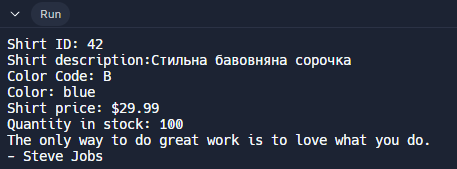

# Завдання 1: Створення та запуск першої програми (сорочки) 👕

## Етап 1: Перший запуск програми
Спочатку я запустив програму зі стандартними значеннями класу `Shirt`:

```java
public class Shirt {
  public int shirtID = 0; // стандартне значення номера моделі сорочки
  public String description = "-description required-"; // стандартний опис сорочки
  // коди кольорів: R=червоний, B=синій, G=зелений, U=невідомо
  public char colorCode = 'U';
  public double price = 0.0; // стандартна вартість сорочки
  public int quantityInStock = 0; // стандартна кількість на складі
  
  // цей метод просто виводить всю інформацію про сорочку на екран
  public void displayShirtInformation() {
    System.out.println("Shirt ID: " + shirtID);
    System.out.println("Shirt description:" + description);
    System.out.println("Color Code: " + colorCode);
    System.out.println("Shirt price: $" + price);
    System.out.println("Quantity in stock: " + quantityInStock);
  }
}
```

## Етап 2: Зміна значень і повторний запуск 🔄

Я змінив дані сорочки на наступні:

```java
public class Shirt {
  public int shirtID = 42; // змінений номер моделі сорочки
  public String description = "Стильна бавовняна сорочка"; // змінений опис сорочки
  // коди кольорів: R=червоний, B=синій, G=зелений, U=невідомо
  public char colorCode = 'B';
  public double price = 29.99; // змінена вартість сорочки
  public int quantityInStock = 100; // змінена кількість на складі
  
  // цей метод просто виводить всю інформацію про сорочку на екран
  public void displayShirtInformation() {
    System.out.println("Shirt ID: " + shirtID);
    System.out.println("Shirt description:" + description);
    System.out.println("Color Code: " + colorCode);
    System.out.println("Shirt price: $" + price);
    System.out.println("Quantity in stock: " + quantityInStock);
  }
}
```

### Результат виконання:


## Висновок ✅
Успішно створено, запущено та модифіковано програму для роботи з інформацією про сорочки. Програма коректно відображає як стандартні, так і змінені значення полів класу `Shirt`.
