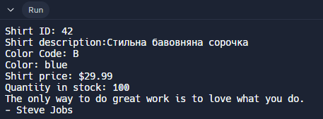

# Завдання 2: Створення та запуск іншої програми (цитати) 📜

## Етап 1: Перший запуск програми
Спочатку я запустив програму зі стандартною цитатою у класі `Quotation`:

```java
public class Quotation {
  String quote = "Welcome to Sun!";
  public void display() {
    System.out.println(quote);
  }
}
```

## Етап 2: Зміна цитати і повторний запуск 🔄

Я змінив цитату на більш надихаючу:

```java
public class Quotation {
  String quote = "The only way to do great work is to love what you do. - Steve Jobs";
  public void display() {
    System.out.println(quote);
  }
}
```

### Результат виконання:


## Висновок ✅
Успішно створено, запущено та модифіковано програму для роботи з цитатами. Програма коректно відображає як стандартну, так і змінену цитату.

### 💡 Цікаві факти про цитати
* Цитати допомагають надихнути та мотивувати людей
* Гарна цитата може змінити настрій та світогляд
* Стів Джобс, автор зміненої цитати, був одним із засновників компанії Apple

### 📝 Корисні ресурси
* [100 кращих цитат всіх часів](https://pakwired.com/100-best-quotes-time/)
* [Wikiquote](https://en.wikiquote.org) - колекція цитат з усього світу
